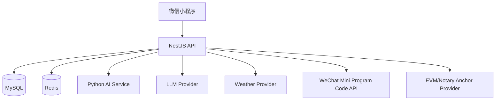

# 橘源通 概要设计文档（项目版）

版本：v3.0  
更新时间：2026-04-23  
对应需求基线：`docs/需求分析文档.md`

---

## 1. 设计目标

本概要设计聚焦“最小可运行、可持续演进”的系统骨架，目标如下：

1. 主链路稳定可运行：病害识别、风险评估、果实分级、溯源校验。  
2. 联调兼容可持续：保留 `/ai/*` 历史入口与关键字段。  
3. 外部依赖可失败：AI、LLM、天气、锚定失败不应中断主流程。  
4. 规则与解释解耦：确定性计算由规则/模型执行，LLM 仅做解释与建议。

---

## 2. 总体架构

### 2.1 技术栈

1. 小程序：微信原生小程序（JS/WXML/WXSS）。  
2. 后端：NestJS 10 + Prisma + MySQL + Redis + JWT。  
3. AI：Python（FastAPI + 规则/模型推理脚本）。  
4. LLM：OpenAI-compatible Chat Completions（后端统一封装）。

### 2.2 系统上下文（逻辑）

### 2.3 分层架构

1. 表现层：`pages/*` + `services/*`，负责交互和请求编排。  
2. 接口层：NestJS `Controller`，负责 DTO 校验和协议适配。  
3. 应用层：`Service`，负责业务编排和异常处理。  
4. 领域层：风险规则、分级定价规则、溯源 hash 校验。  
5. 基础设施层：Prisma、Redis、上传存储、外部服务客户端。

---

## 3. 后端公共设计

### 3.1 统一入口规范

1. 全局前缀：`/api`。  
2. 前缀例外：`/ai/disease/predict`、`/ai/fruit/grade`。  
3. 全局响应：`{ code, message, data }`。  
4. 全局异常：`BusinessException + ErrorCode`。  
5. 全局鉴权：JWT 守卫，`@Public()` 例外。

### 3.2 统一质量机制

1. `ValidationPipe` 强制 DTO 白名单与类型转换。  
2. 统一错误码映射（未授权/参数错误/不存在/禁止访问/操作失败）。  
3. 请求失败前端统一提示并处理 401 自动退登录。

---

## 4. 模块拆分与职责

| 模块 | 核心职责 | 关键依赖 | 关键输出 |
|---|---|---|---|
| `auth` | 登录、发码、退出、profile | Prisma、Redis、JWT | token、userInfo |
| `user` | 当前用户/指定用户查询 | Prisma、角色守卫 | 用户基础资料 |
| `batch` | 批次列表、详情、创建、阶段更新 | Prisma | 批次对象、统计信息 |
| `log` | 农事日志查询与写入 | Prisma | 日志时间线对象 |
| `disease` | 病害推理编排与落库 | Upload、AI Client、LLM | label/confidence/advice |
| `risk` | 风险规则评估与历史 | RiskEngine、LLM、Prisma | level/reason/suggestion |
| `price` | 分级定价编排 | FruitInference、PriceEngine、LLM | grade/price range/factors |
| `product` | 产品列表与二维码生成 | Trace、WeChat MiniCode、QRCode | traceCode/qrcodeBase64 |
| `trace` | 快照、proof、验真、锚定增强 | Hash/Notary/EVM provider | verified/proofHash/anchor |
| `weather` | 实时天气与预报缓存 | real/mock provider、Prisma | current/forecast |
| `upload` | 图片校验与存储 | local/minio storage | 上传 URL |
| `ai` | 统一叙事服务 | `src/llm` | 解释文案 |

---

## 5. 核心链路概要设计

### 5.1 病害识别链路

1. 小程序上传图片（`wx.uploadFile`）。  
2. 后端接收 `file/imageUrl + batchId`。  
3. 通过 `DiseaseInferenceClient` 调远程 AI；失败回退本地规则。  
4. 计算 `needManualReview`，调用 LLM 生成建议。  
5. 入库 `disease_records`。  
6. 兼容输出 `label/confidence/severity/advice`。

### 5.2 果实分级链路

1. 输入归一化（渠道、包装、结构化特征）。  
2. 感知层输出质量特征（远程 AI 或本地回退）。  
3. 规则引擎计算等级与价格区间。  
4. LLM 输出解释与风险提示增强。  
5. 结果回传并尝试落库 `fruit_grade_records`。

### 5.3 风险评估链路

1. 聚合批次阶段、天气缓存、病害记录、灌溉记录。  
2. `RiskEngineService` 打分得到 `overallLevel`。  
3. LLM 仅润色 `reason/suggestion`。  
4. 落库 `risk_records`。  
5. 返回兼容字段：`level/levelText/reason/suggestion`。

### 5.4 溯源与验真链路

1. 产品生成二维码时触发 trace 快照写入。  
2. 依据快照生成 `proofHash`。  
3. `GET /api/trace/:code` 返回聚合详情。  
4. `GET /api/trace/:code/verify` 重算 hash 比对。  
5. 可选 EVM/Notary 锚定作为增强，不改本地主判定。

### 5.5 天气与风险联动链路

1. 天气接口先读当日缓存。  
2. 未命中时调用 provider 拉取并回写缓存。  
3. 风险评估读取天气缓存参与规则计算。

---

## 6. 数据模型概要

核心表：

1. `users`：账号与角色。  
2. `batches`：批次主档。  
3. `farming_logs`：农事日志。  
4. `disease_records`：病害识别记录。  
5. `risk_records`：风险评估记录。  
6. `products`：产品与二维码状态。  
7. `trace_records`：快照、proof、验真、锚定。  
8. `fruit_grade_records`：分级定价结果。  
9. `weather_cache`：天气缓存。

设计重点：

1. 写模型保持可追溯字段（`requestId/modelVersion/source`）。  
2. trace 快照采用 JSON 存储，支持“重算 hash 验真”。

---

## 7. 接口与兼容策略

### 7.1 路径兼容

1. 保留 `/ai/disease/predict`、`/ai/fruit/grade`。  
2. 风险保留 `/api/risk/:batchId` 与 `/api/risk/assessment` 双入口。

### 7.2 字段兼容

1. 病害：`label/advice/needManualReview` 不可删除。  
2. 分级：价格区间与 `factors` 字段不可破坏。  
3. 风险：`level/levelText/reason/suggestion` 不可破坏。  
4. 参数兼容：`batchId/batch_id`、`pageSize/limit`、`packageType/packaging`。

### 7.3 响应兼容

所有成功接口统一返回 `code=0` 包装结构，错误接口统一错误码体系。

---

## 8. 配置与部署概要

### 8.1 配置管理

新增配置需同步：

1. `backend/.env.example`  
2. `backend/src/config/configuration.ts`  
3. `backend/src/config/env.validation.ts`

### 8.2 关键配置域

1. `AI_SERVICE_URL/FRUIT_PERCEPTION_PATH/DISEASE_AI_*`：AI 服务调用。  
2. `LLM_* / OPENAI_* / DEEPSEEK_*`：LLM 调用。  
3. `TRACE_* / EVM_*`：溯源锚定能力。  
4. `WECHAT_MP_*`：小程序码能力。  
5. `WEATHER_*`：天气 provider 模式。

### 8.3 部署拓扑（MVP）

1. 小程序前端由微信运行时承载。  
2. NestJS 提供统一业务 API。  
3. Python AI 服务独立进程/容器。  
4. MySQL + Redis 作为状态与缓存层。

---

## 9. 安全设计概要

1. 鉴权：JWT Bearer。  
2. 权限：角色守卫 + 本人/管理员守卫。  
3. 输入安全：DTO 校验 + 白名单。  
4. 敏感信息：日志脱敏（API Key、私钥、token、password）。  
5. 上传安全：文件大小和 MIME 限制。

---

## 10. 稳定性与回退设计

### 10.1 回退矩阵

| 场景 | 主路径 | 回退路径 | 主流程是否中断 |
|---|---|---|---|
| 病害远程 AI 失败 | 远程推理 | 本地规则识别 | 否 |
| 果实感知失败 | 远程感知 | 本地感知规则 | 否 |
| LLM 失败 | LLM 文案 | deterministic 文案 | 否 |
| 天气 real provider 失败 | real provider | mock/provider 切换 | 否 |
| 小程序码失败 | WeChat code | 普通二维码 | 否 |
| 锚定失败 | EVM/Notary | 本地 hash 验真 | 否 |

### 10.2 一致性保证

1. trace 由 `TraceService` 统一生成/更新，避免 hash 与快照漂移。  
2. 关键写入优先事务（如批次创建时自动产品创建）。

---

## 11. 可观测性概要

1. 后端日志记录关键回退原因。  
2. LLM/锚定日志默认脱敏。  
3. 后续建议增加指标：成功率、超时率、回退率、均值耗时、P95。

---

## 12. 设计约束与已知风险

1. `logout` 仍是 MVP 语义，未实现 token 黑名单。  
2. 果实分级数据集存在结构性偏置（region/channel/package_type 单一）。  
3. 生产环境若开启前端 mock fallback，可能掩盖真实接口问题。  
4. EVM 锚定依赖链上配置和 RPC 稳定性。

---

## 13. 后续扩展方向

1. 完善会话治理（黑名单/刷新机制）。  
2. 增加契约自动回归（接口字段快照）。  
3. 增加 AI 推理观测表与审计链路。  
4. 引入训练数据质量门禁（CI 阶段 strict 检查）。
